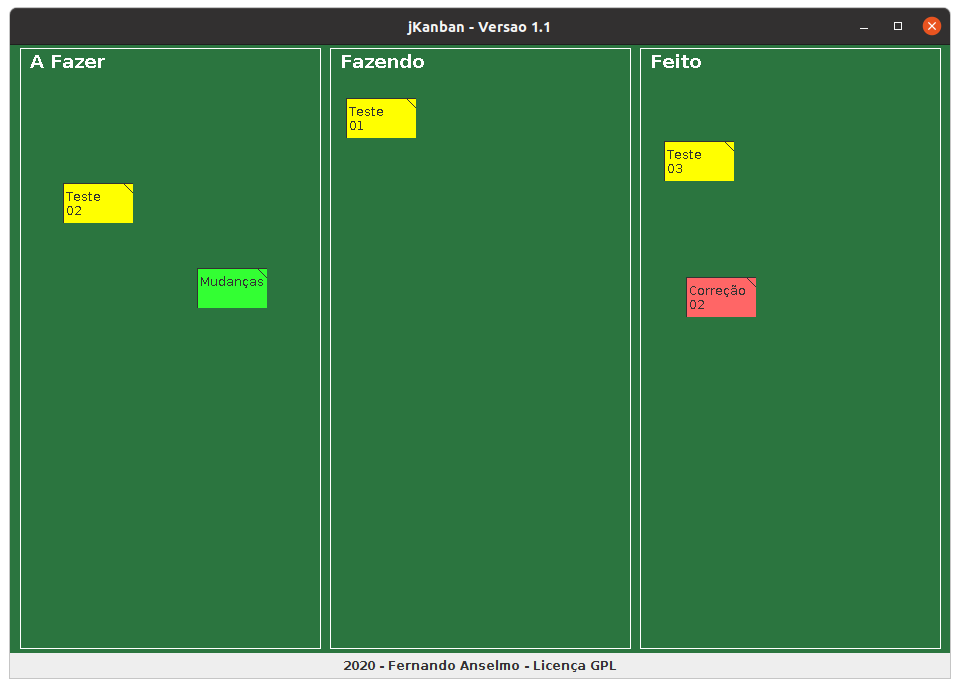

# jKanban

## Manual de Uso

Para sua execução é necessário ter o Java 8.0 (versão JRE) instalado ou superior. 

Execução: 
```
java -jar Kanban.jar
```

 

Ao ser aberto, teremos a tela do Kanban com 3 áreas (chamada de “board”). Ao clicar com o botão direito do mouse sobre o “board” obtemos as seguintes opções:

* Tarefa: criação de um Post-It para colocar a tarefa a realizar
* Abrir: abrir um projeto
* Salvar: salvar um projeto
* Salvar Imagem: salvar a tela do projeto

Uma tarefa pode ser posicionada em qualquer das 3 áreas dependendo de sua situação, ao clicar com o botão direito do mouse sobre esta obtemos as seguintes opções:

* Descrição: modificar a descrição da tarefa
* Cor de Fundo: modificar a cor de fundo da tarefa, use cores para diferenciar prioridades
* Excluir: eliminar a tarefa

## Software em Sustentação:

**Versão 1.1:**
* Resolvido o problema de travamento
* Ajustes do Sistema conforme o SonarLint.
* Melhora do serviço de salvar imagem.
* Aceleração dos processos para transformar o sistema mais leve.

**Versão 1.0:**

* Criação do Sistema.
* Disponibilização das Funcionalidades desejadas.